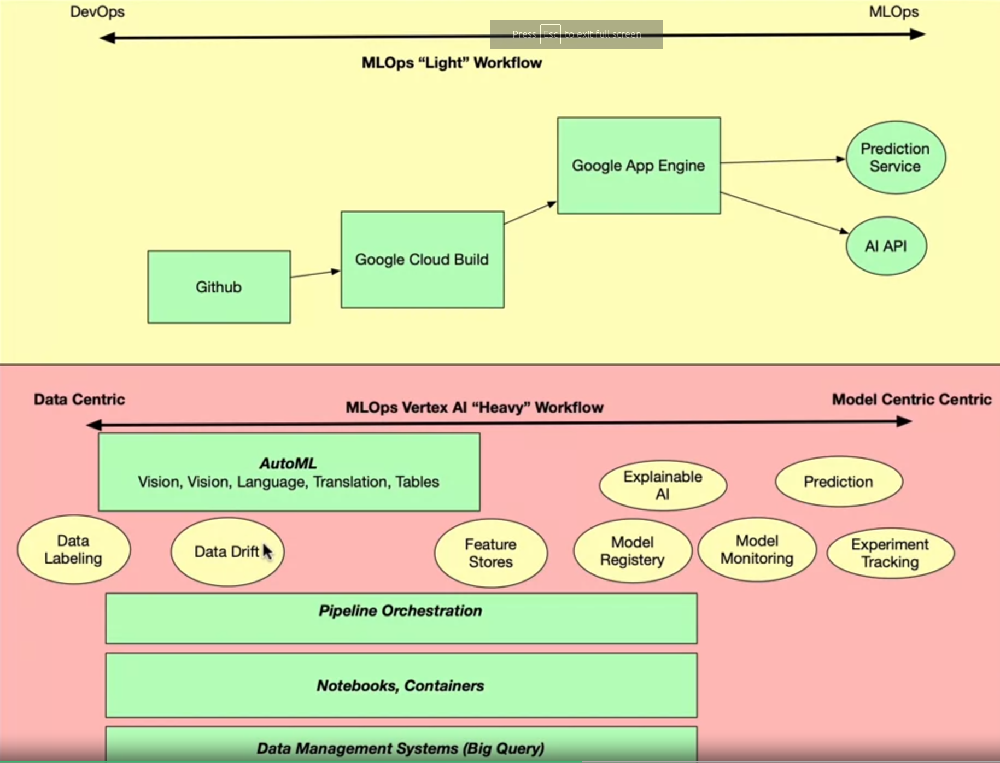
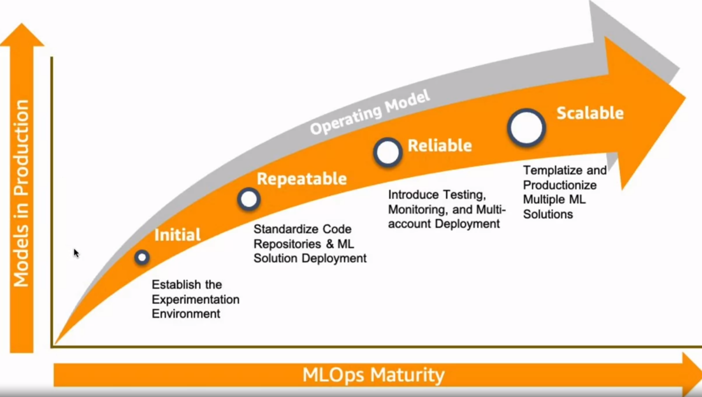
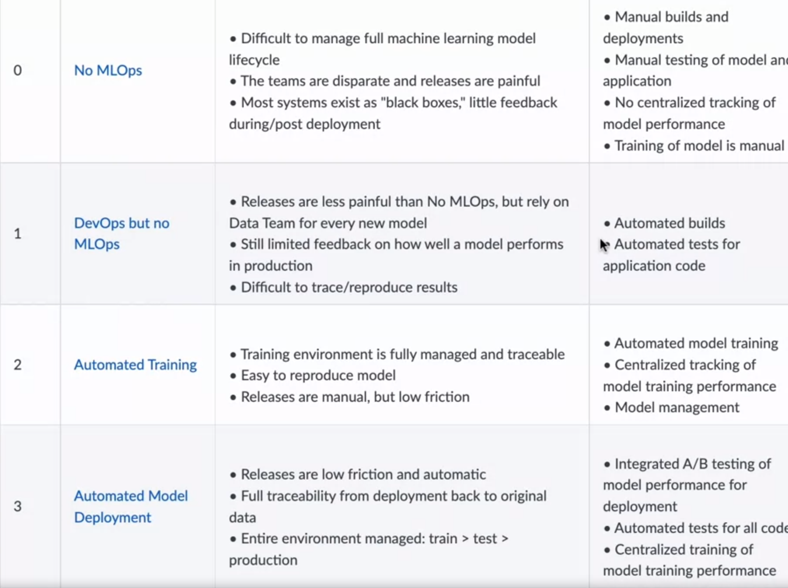
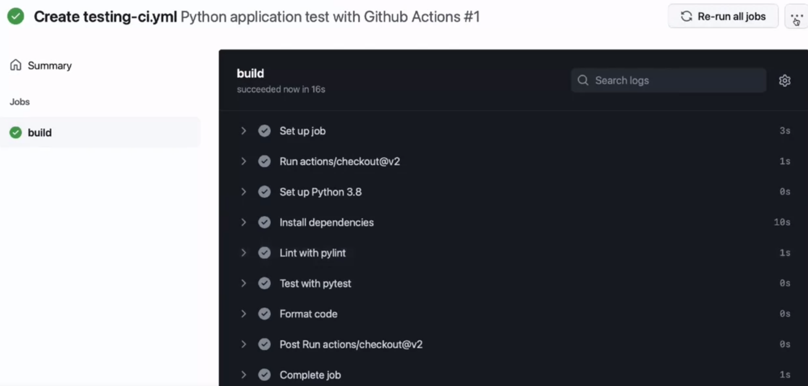
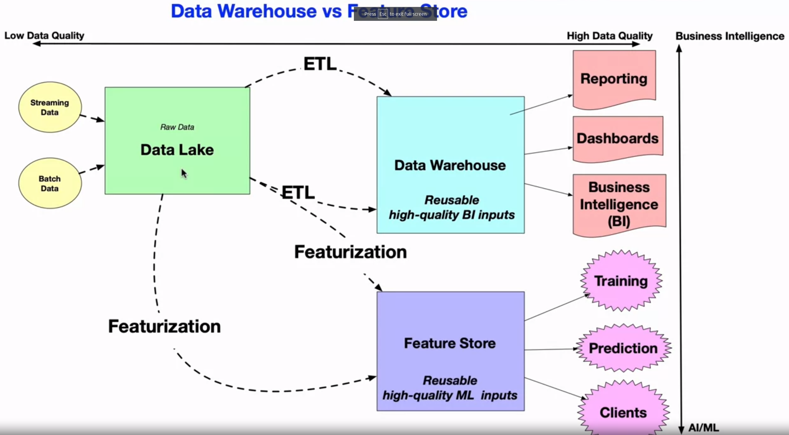
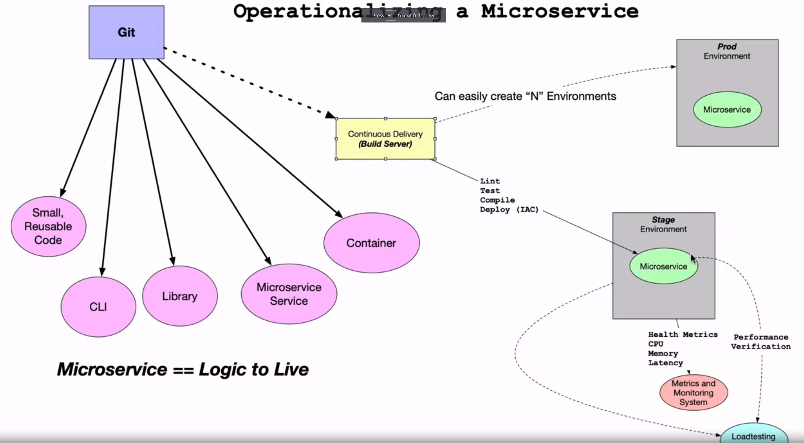

# DevOps, DataOps, MLOps by Duke University @ Coursera

---

## NOTES

### Week 1 - Key concepts in MLOps

In the beginning of the course, it is commented that at the heart of MLOps, there is something called "Kayzen", which is a japanese word that means "continuous improvement". DevOps also takes advantage of this notion. 

Also important is the notion that MLOps can be thought of as:
- 25% DevOps
- 25% data related stuff such as automation and processing pipelines
- 25% model related stuff such as model improvement, prototyping
- 25% framing and looking at the business requirements 

When it comes to why MLOps is trending right now, there are 3 major topics that are highlighted:
- ROI for data science applications are not well thought of:
    - Basically, there are not enough methodology involved in adopting data science modelling in the industry
- Results over experiments:
    - As it stands, data science borrows a lot from academic science, which means a lot of experimenting. This is great, but it poses challenges to ROI. Results are sometimes forgotten or pushed forward way too much
- High-level tools are desirable and MLOps can deliver those:
    - Basically, removing the need of human specialists and improving ways of having "normal" people contribute to data science applications and development

*My personal take here:*
- *I do not feel comfortable thinking about MLOps as a way of decreasing quality of code by promoting profits over experimentation. Also, I believe there is a limit to what high-level tools can be applied to. Having said that, I also believe MLOps might be essential to democratizing DS model development and usage.*

Differentiating between primary and secondary cloud platforms is interesting:
- Primary platform must be low cost, popular, easy to hire and use
- Secondary platform, **if necessary**, must be able to solve one problem very well

It is not said in the course, but I want to add that one must be careful about adopting a platform and/or a solution provided by them. Sometimes, you will find out there is a cool solution to deal with parallel processing, for example. It is paid, but it not too much, so you start using it. 3 years go by and now you decide you want to change platform and/or change the solution. You will quickly find out there are several challenges to do that, mainly because it is part of the solution's design to lock you into it. Whenever possible, try to adopt open source solution and avoid vendor-locking. 

Key certifications for MLOps are addressed:
- AWS Machine Learning
- AWS Data Analytics
- AWS Solutions Architect
- Snowflake Snowpro Architect
- Databricks certified developer for Apache Spark v2
- MLRun
- Kubernetes application developer
- Google cloud Machine Learning Engineer

For future trends, it is mentioned:
- The comeback of Network File System (NFS), which basically allows "a user on a client computer to access files over a computer network much like local storage is accessed" [[REF]](https://en.wikipedia.org/wiki/Network_File_System). Because of that, there might a trend for **NFOps**. Basically, you have real time access over the internet to both deployment and data of DS applications
- Kubernetes and Kubeflow are going nowhere. Managing Kubernetes will increase in demand
- Edge ML, which is "the process of running machine learning algorithms on computing devices at the periphery of a network to make decisions and predictions as close as possible to the originating source of data" [[REF]](https://docs.edgeimpulse.com/docs/concepts/what-is-edge-machine-learning)
- ESG 
- Model portability between different frameworks and adoption of universal formats like ONNX 
- There is this good analogy:

| Food           | Machine Learning |
|----------------|:----------------:|
|      Flour     |   Train a model  |
|  Frozen Pizza  |      AutoML      |
| Pizza delivery |     Model API    |

In regards to MLOps workflows, there are two main scenarios:


Reference: https://www.coursera.org/learn/devops-dataops-mlops-duke/lecture/vdlik/mlops-heavy-vs-light

There is a hierarchy of needs associated with MLOps:
1. DevOps
2. DataOps
3. Platform
4. Finally, MLOps

There are lots of different phases before you can achieve a sophisticated MLOps workflow. Maturity models are provided by platforms to help you (the client) better understand where you are at. 

**AWS:**


**Azure**:


**GCP**:
- Level 0: Manual process
- Level 1: ML pipeline automation
- Level 2: CI/CD pipeline automation

More details at https://cloud.google.com/architecture/mlops-continuous-delivery-and-automation-pipelines-in-machine-learning

**Testing code before pushing to production is an art**:
- The professor has created a tool on top of pytest for simple python testing in [here](https://github.com/noahgift/pytest-tips-tricks) and there is a YouTube masterclass [here](https://www.youtube.com/watch?v=IN4qt-9bMiE)
- Principle of testing python code:

```python
def hello():
    return "hi"

def test_hello():
    assert "hi" == hello()
```

- Above you can see simple code to test if what is returning from a function is actually what you want. But the important thing here is not the syntax of testing python code, but configurations you can do to take your testing to the next level. One of those configurations relies on a well written `Makefile`:
    - The `Makefile` should be in the root directory of your repository to facilitate navigating trough paths and overall code adhesion
    - There is a simple syntax to be obeyed when writing a `Makefile`:

    ```
    target: prerequisites
        recipe
    ```

    - The default goal of a `Makefile` will be to run the first target. To change that, you can pass `.DAFAULT_GOAL := new goal` to change the default goal to some other target or if you want multiple targets to be executed you can pass `all: target1 target2 ... targetn` 
    - You can use `.PHONY: targetn` to specify all targets that are not files, meaning they are most likely defined inside of the `Makefile`
    - Below there is an example of what a simple `Makefile` for testing should look like:

    ```
    .PHONY: all say_hello generate clean

    all: say_hello generate

    say_hello:
        @echo "Hello World"

    generate:
        @echo "Creating empty text files..."
        touch file-{1..10}.txt

    clean:
        @echo "Cleaning up..."
        rm *.txt
    ```

    - If you call `make` for the code above it will execute `say_hello` and `generate`. To run `clean` you have to manually call it typing `make clean`

- If you want to take it to the next next level you can rely on a `.yaml` file to configure jobs based on a action. In the case o CI, the action could be pushing to a specific repo branch, for example. When that happens, you can trigger jobs to install dependencies on a cloud env, test the code, and format it. Below you can see an example from [this repository](https://github.com/noahgift/github-actions-demo/tree/main):

```
name: Python application test with GitHub Actions

on: [push]

jobs:
  build:

    runs-on: ubuntu-latest

    steps:
    - uses: actions/checkout@v2
    - name: Set up Python 3.8
      uses: actions/setup-python@v1
      with:
        python-version: 3.8
    - name: Install dependencies
      run: |
        make install
    - name: Lint with pylint
      run: |
        make lint
    - name: Test with pytest
      run: |
        make test
    - name: Format code
      run: |
        make format
```
The output from GitHub Actions should be:


Idempotence is a principle of IaC:
- The "ability of a given operation to always produce the same result" [[REF]](https://learn.microsoft.com/en-us/devops/deliver/what-is-infrastructure-as-code)

Feature store vs data warehouse:

Reference: 
https://www.coursera.org/learn/devops-dataops-mlops-duke/lecture/bjLc7/what-is-a-feature-store

---
### Week 1 - Foundations of End to End MLOps with Web Apps and Microservices

Operationalizing a microservice:

Reference: https://www.coursera.org/learn/devops-dataops-mlops-duke/lecture/JC46u/operationalizing-a-microservice

End to end MLOps HuggingFace spaces is a cool example:
- When you create a space to host your model application, you will also automatically create a git repository
- When you clone this repository, you will see some files already inside of it
- At the same time, the professor creates a GitHub repository. He also enable `codespaces` for that repository:
  - Setting up a virtual env inside the `codespaces`:

  ```bash
  virtualenv ~/.venv
  vim ~/.bashrc
  ```

  - Inside the bashrc file, just add:

  ```bash
  source ~/.venv/bin/activate
  ```
- Inside the codespaces, the professor uses `touch` to create:
  - `requirements.txt` 
  - `app.py`
  - `Makefile`
- The professor then proceeds to add code to these files in order to create a simple model application
- The professor goes back to HuggingFace, goes to his profile -> Settings -> Access Tokens -> New Token:
- He copies the token and head back to his GitHub repository -> Settings -> Secrets -> Actions -> New repository secret
- He pastes the token to the new repository secret
- He goes to Actions -> set up a workflow yourself:
  - You will have to edit a `.yaml` file to configure your CI pipeline
- After doing all of that, the professor goes back to the HuggingFace spaces to clone his git repository locally
- He pushes the content of the GitHub repository to the HuggingFace. That's it, now every time you push to the main branch on the GitHub repository, it will sync with your application ("production") environment on HuggingFace. This is an example of CI

Using FastAPI framework and AWS App Runner to run a microservice:
- The professor uses AWS Cloud9 to use his cloud environment. Details on how he sets up the microservice can be found in [here](https://github.com/noahgift/fastapi)

Flask application example:
- Apart from some specific stuff you can do to the UI, the idea is the same. More details can be found in [here](https://github.com/noahgift/flask-random-fruit)


