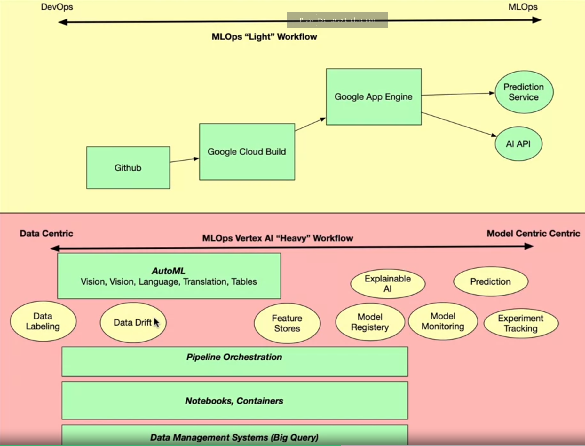
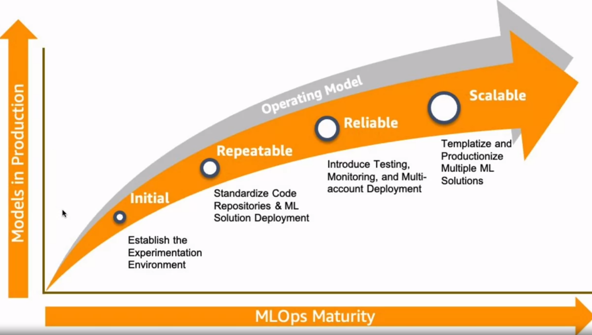
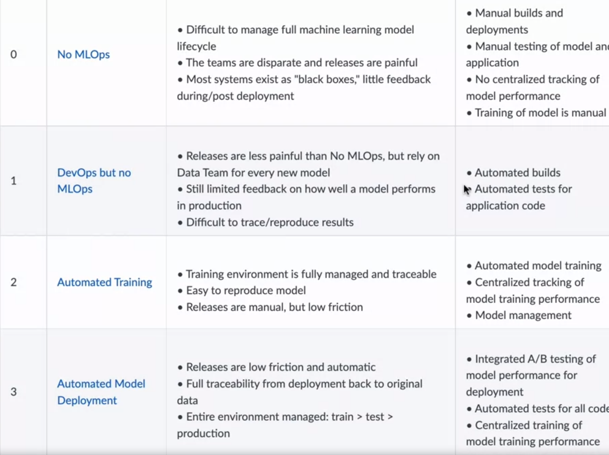

# DevOps, DataOps, MLOps by Duke University @ Coursera

---

## NOTES

### Week 1

In the beginning of the course, it is commented that at the heart of MLOps, there is something called "Kayzen", which is a japanese word that means "continuous improvement". DevOps also takes advantage of this notion. 

Also important is the notion that MLOps can be thought of as:
- 25% DevOps
- 25% data related stuff such as automation and processing pipelines
- 25% model related stuff such as model improvement, prototyping
- 25% framing and looking at the business requirements 

When it comes to why MLOps is trending right now, there are 3 major topics that are highlighted:
- ROI for data science applications are not well thought of:
    - Basically, there are not enough methodology involved in adopting data science modelling in the industry
- Results over experiments:
    - As it stands, data science borrows a lot from academic science, which means a lot of experimenting. This is great, but it poses challenges to ROI. Results are sometimes forgotten or pushed forward way too much
- High-level tools are desirable and MLOps can deliver those:
    - Basically, removing the need of human specialists and improving ways of having "normal" people contribute to data science applications and development

*My personal take here:*
- *I do not feel comfortable thinking about MLOps as a way of decreasing quality of code by promoting profits over experimentation. Also, I believe there is a limit to what high-level tools can be applied to. Having said that, I also believe MLOps might be essential to democratizing DS model development and usage.*

Differentiating between primary and secondary cloud platforms is interesting:
- Primary platform must be low cost, popular, easy to hire and use
- Secondary platform, **if necessary**, must be able to solve one problem very well

It is not said in the course, but I want to add that one must be careful about adopting a platform and/or a solution provided by them. Sometimes, you will find out there is a cool solution to deal with parallel processing, for example. It is paid, but it not too much, so you start using it. 3 years go by and now you decide you want to change platform and/or change the solution. You will quickly find out there are several challenges to do that, mainly because it is part of the solution's design to lock you into it. Whenever possible, try to adopt open source solution and avoid vendor-locking. 

Key certifications for MLOps are addressed:
- AWS Machine Learning
- AWS Data Analytics
- AWS Solutions Architect
- Snowflake Snowpro Architect
- Databricks certified developer for Apache Spark v2
- MLRun
- Kubernetes application developer
- Google cloud Machine Learning Engineer

For future trends, it is mentioned:
- The comeback of Network File System (NFS), which basically allows "a user on a client computer to access files over a computer network much like local storage is accessed" [[REF]](https://en.wikipedia.org/wiki/Network_File_System). Because of that, there might a trend for **NFOps**. Basically, you have real time access over the internet to both deployment and data of DS applications
- Kubernetes and Kubeflow are going nowhere. Managing Kubernetes will increase in demand
- Edge ML, which is "the process of running machine learning algorithms on computing devices at the periphery of a network to make decisions and predictions as close as possible to the originating source of data" [[REF]](https://docs.edgeimpulse.com/docs/concepts/what-is-edge-machine-learning)
- ESG 
- Model portability between different frameworks and adoption of universal formats like ONNX 
- There is this good analogy:

| Food           | Machine Learning |
|----------------|:----------------:|
|      Flour     |   Train a model  |
|  Frozen Pizza  |      AutoML      |
| Pizza delivery |     Model API    |

In regards to MLOps workflows, there are two main scenarios:

Reference: https://www.coursera.org/learn/devops-dataops-mlops-duke/lecture/vdlik/mlops-heavy-vs-light

There is a hierarchy of needs associated with MLOps:
1. DevOps
2. DataOps
3. Platform
4. Finally, MLOps

There are lots of different phases before you can achieve a sophisticated MLOps workflow. Maturity models are provided by platforms to help you (the client) better understand where you are at. 

**AWS:**

**Azure**:

**GCP**:
- Level 0: Manual process
- Level 1: ML pipeline automation
- Level 2: CI/CD pipeline automation

More details at https://cloud.google.com/architecture/mlops-continuous-delivery-and-automation-pipelines-in-machine-learning

